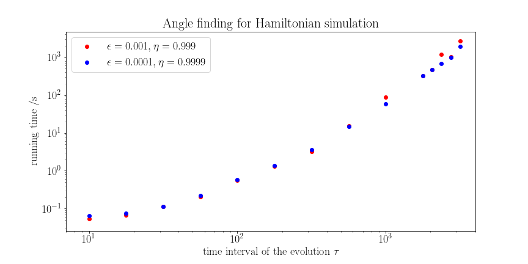

# Angle Sequence: Finding Angles for Quantum Signal Processing

## Introduction

[Quantum signal processing](https://journals.aps.org/prl/abstract/10.1103/PhysRevLett.118.010501) is a framework for quantum algorithms including Hamiltonian simulation, quantum linear system solving, amplitude amplification, etc. 

Quantum signal processing performs spectral transformation of any unitary $U$, given access to an ancilla qubit, a controlled version of $U$ and single-qubit rotations on the ancilla qubit. It first truncates an arbitrary spectral transformation function into a Laurent polynomial, then finds a way to decompose the Laurent polynomial into a sequence of products of controlled-$U$ and single qubit rotations on the ancilla. Such routines achieve optimal gate complexity for many of the quantum algorithmic tasks mentioned above.

Our software package provides a lightweight solution for classically solving for the single-qubit rotation angles given the Laurent polynomial, a task called *angle sequence finding* or *angle finding*. Our package only depends on `numpy` and `scipy` and works under machine precision. Please see below for a chart giving the performance of our algorithm for the task of Hamiltonian simulation:

  

Please see the [arXiv manuscript](https://arxiv.org/abs/2003.02831) for more details.

## Code Structure and Usage

* `angle_sequence.py` is the main module of the algorithm.
* `LPoly.py` defines two classes `LPoly` and `LAlg`, representing Laurent polynomials and Low algebra elements respectively.
* `completion.py` describes the completion algorithm: Given a Laurent polynomial element $F(\tilde{w})$, find its counterpart $G(\tilde{w})$ such that $F(\tilde{w})+G(\tilde{w})*iX$ is a unitary element.
* `decomposition.py` describes the halving algorithm: Given a unitary parity Low algebra element $V(\tilde{w})$, decompose it as a unique product of degree-0 rotations $\exp\{i\theta X\}$ and degree-1 monomials $w$.
* `ham_sim.py` shows an example of how the angle sequence for Hamiltonian simulation can be found.

To find the angle sequence corresponding to a real Laurent polynomial $A(\tilde{w}) = \sum_{i=-n}\^n a_i\tilde{w}\^i$, simply run:

    from angle_sequence import angle_sequence
    ang_seq = angle_sequence([a_{-n}, a_{-n+2}, ..., a_n])
    print(ang_seq)

## Publication
* Rui Chao, Dawei Ding, Andr&aacute;s Gily&eacute;n, Cupjin Huang, and Mario Szegedy. [Finding Angles for Quantum Signal Processing with Machine Precision](https://arxiv.org/abs/2003.02831). arXiv preprint arXiv:2003.02831 (2020).
